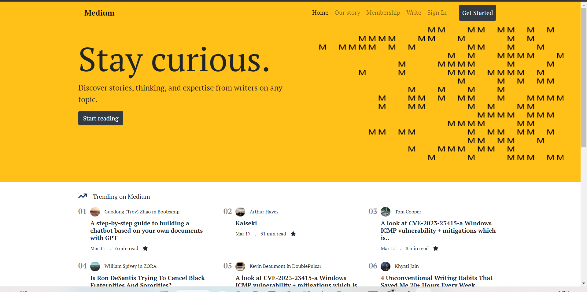
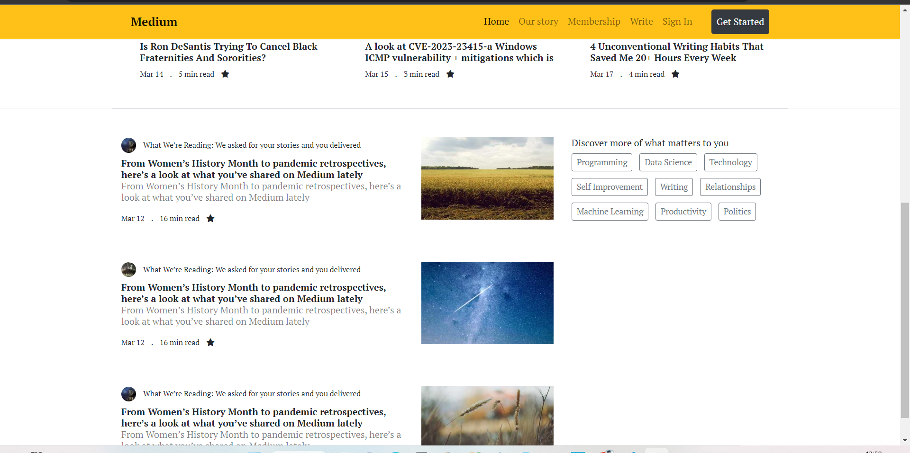

# Bootstrap ile Medium Klon Çalışması
Bu repo [kodluyoruz](https://kodluyoruz.org/) Front-end eğitimde oluşturduğumuz Bootstrap ile Medium Klon Çalışması adı altında on ikinci repo. İçerisinde README.md, index.html, images, css, js, fontawesome dosyası barındırıyor.

## Proje Görünümü

## Hesaplarım 

Github [click](https://github.com/cetinyazici) !

LinkedIn [click](https://www.linkedin.com/in/cetinyazici/) !

Patika.dev [click](https://app.patika.dev/yazilimyazici) !